# 项目介绍

&emsp;**2024 年合工大大三 上学期 实训**，《知识共享平台》选题。

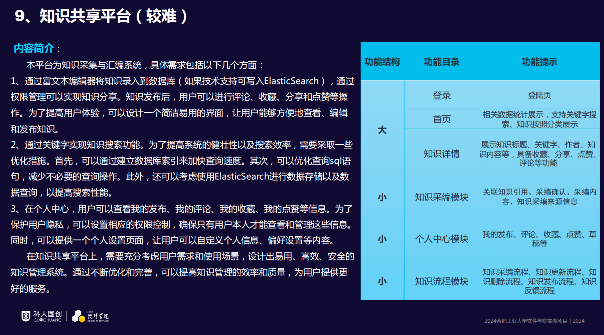

> &emsp;**我第一个微服务项目，也是我一个人包揽前后端工作的微服务项目**。（知识内容模块、数据分析模块以及 MinIO 业务由另外一名同学负责，ORM 使用的 Mybatis，最初是屎山，合并时被我简单了优化了下）

## 实现概述

- 采用`前后端分离`架构;
- 基于`JWT技术`进行认证和授权，实现不同权限对接口的访问授权;
- 采用`微服务架构`来统一管理后端业务,使用 Spring Cloud 全家桶;
- 消息队列使用`Rabbit MQ`，进行模块之间的异步通信;
- 使用`Redis`作为整个系统的缓存组件;
- 使用`MySQL`、`Elasticsearch`作为整个系统的持久化存储组件;
- 使用`Elasticsearch`作为平台的搜索引擎;
- 接口统一使用`RESTful API`规范;
- 使用`Markdown`作为知识内容的编写与渲染；
- 使用`MinIO`作为平台的对象存储平台；

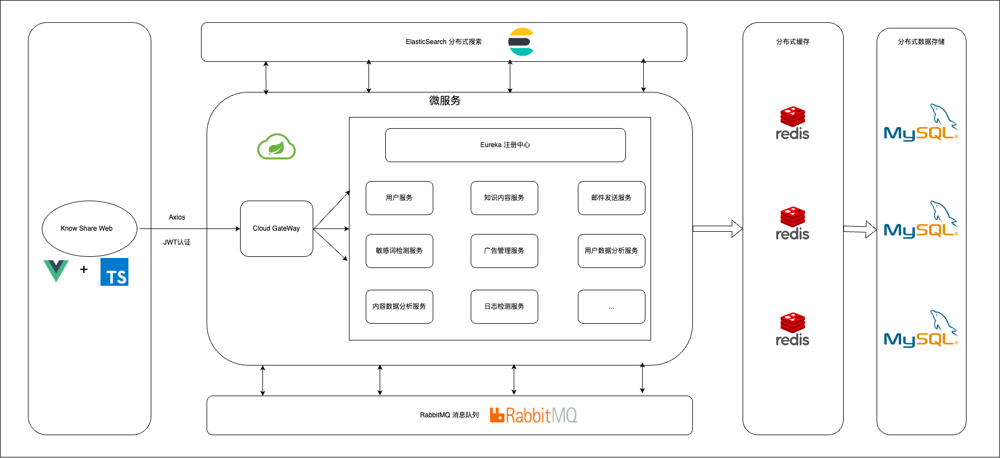

## 技术栈

### 版本要求

- Node >= 19
- Vue 3.x
- JDK >= 17
- Spring Boot 3.0.x
- MySQL >= 8.0
- Elasticsearch = 8.11.3
- Redis 任意
- Rabbit MQ 任意

### 前端

- [Vue 3.x + TS](https://cn.vuejs.org/guide/introduction.html): 这是前端整个项目的基础框架，前端业务需要使用`TypeScript`而非`JavaScript`。TS 强调了数据类型的规范，可以定义接口（可视为类），有 Java 基础的可以快速入手，使用 TS 这有利于前后端的数据类型保持一致。

- [Axios](https://axios-http.com/): 用于发起网络请求。我们整个系统是采用前后端分离架构，数据交互的类型均是 JSON 格式。`前端使用Axios向后端对外暴露的接口发起请求就可以获取到对应的数据，拿到数据后，就可以使用Vue语法将数据渲染出来`。
- [Element-Plus](https://element-plus.org/zh-CN/): Element-Plus 是基于 Vue 3 的 Element 组件，组件是我们实现网页效果的工具，例如轮播图、表单、菜单栏、搜索框均可以使用 Element 组件实现。`整个前端网页均要采用Element-Plus组件实现，保证整个系统的风格一致`。
- [Vditor](https://github.com/Vanessa219/vditor):这是 Markdown 编辑器，基于 Vue 3 实现的。
- [Markdown-it](https://github.com/markdown-it/markdown-it): 渲染 Markdown 语法的库。

### 后端

- `Spring Boot`: 后端整个业务的脚手架。
- `MyBatis-Plus`和`Spring Data JPA`: ORM 框架；
- `Spring-Email`: 邮件发送组件；
- `Spring Cloud Eureka`: 微服务的注册中心；
- `Spring Cloud Gateway`: 微服务网关；
- `Spring Cloud Openfeign`: 微服务之间的服务调用框架
- `Spring Security 6.x`: 基于 Spring Security 实现 JWT 认证；
- `Spring Data Elasticsearch`: 操作 ES 的框架；
- `Spring Data Cache`: 缓存框架，使用 Redis；

- 九个模块：
  - `admin`：整个系统的监控
  - `advertise`：广告业务
  - `common`：所有模块涉及到的公共部分
  - `elasticsearch`：ES 业务
  - `eureka`：微服务注册中心
  - `gateway`：微服务网关
  - `logs`：日志业务
  - `sensitive`：敏感检测业务
  - `uaa`：身份校验与授权业务
- 五个模块：
  - `email`：邮件发送业务
  - `knowledge-content`：知识内容管理业务
  - `knowledge-content-analyze`：知识内容数据分析业务
  - `user`：用户业务
  - `user-analyze`：用户数据分析业务

## 效果

#### 登录页面

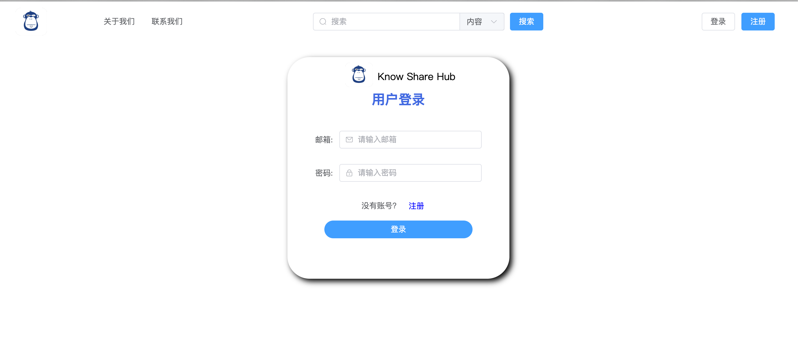

#### 注册页面

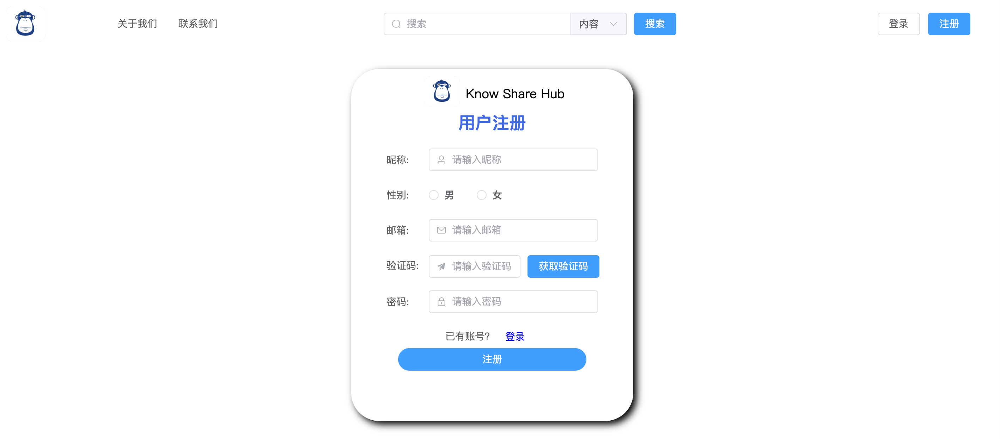

#### 首页页面

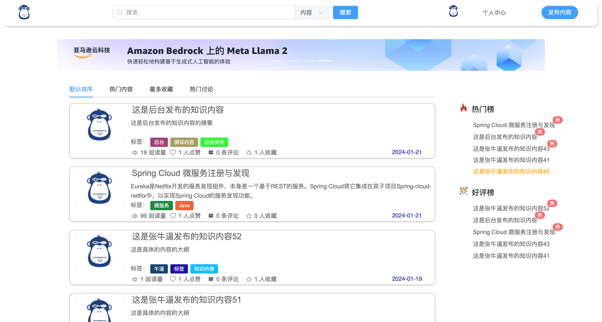

#### 用户后台

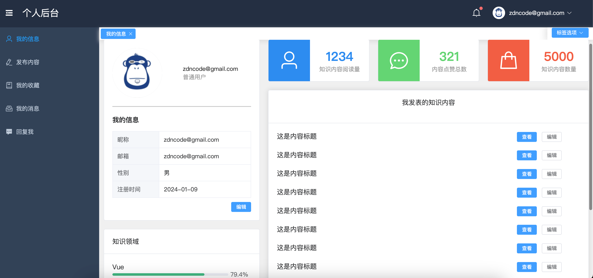

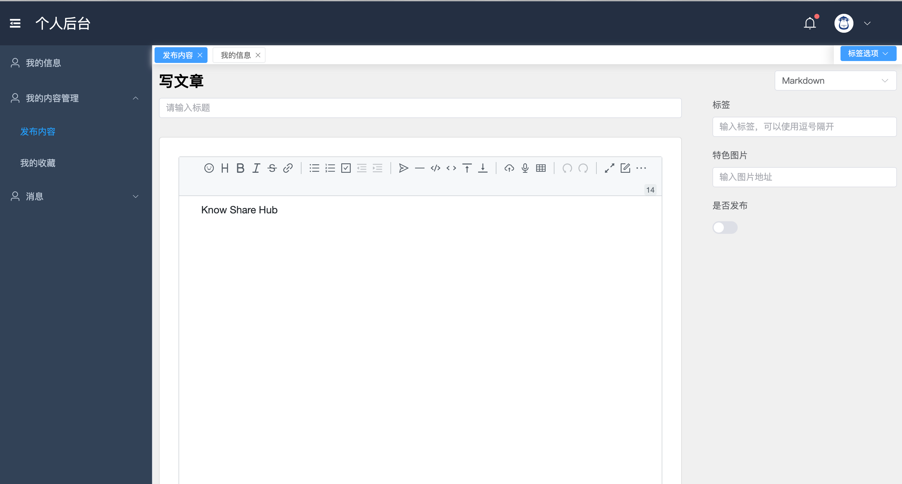

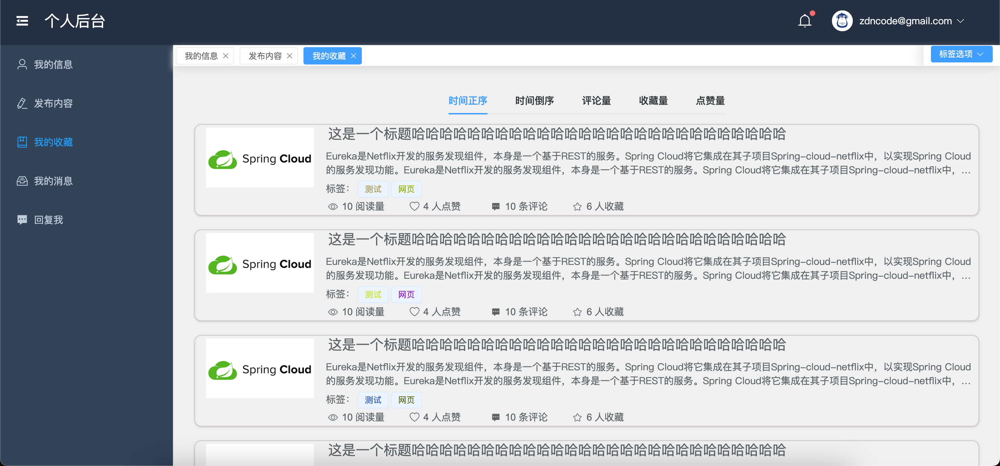

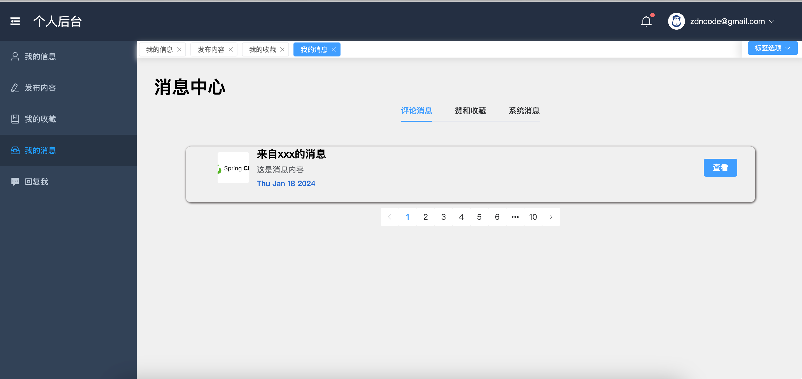

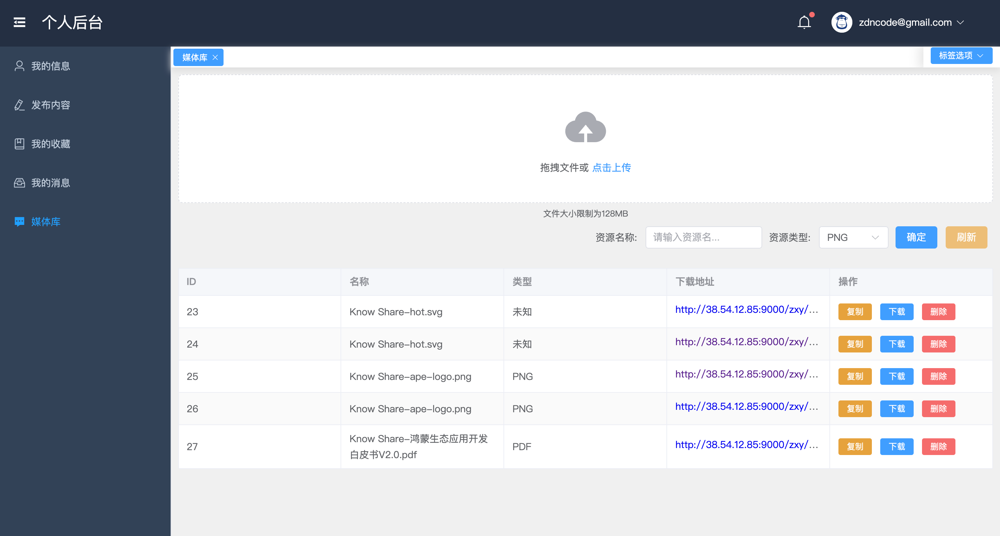

#### 管理员后台

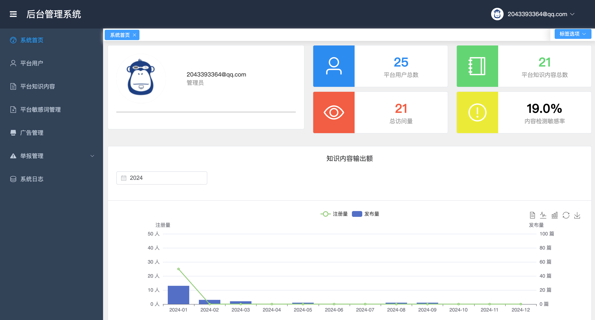
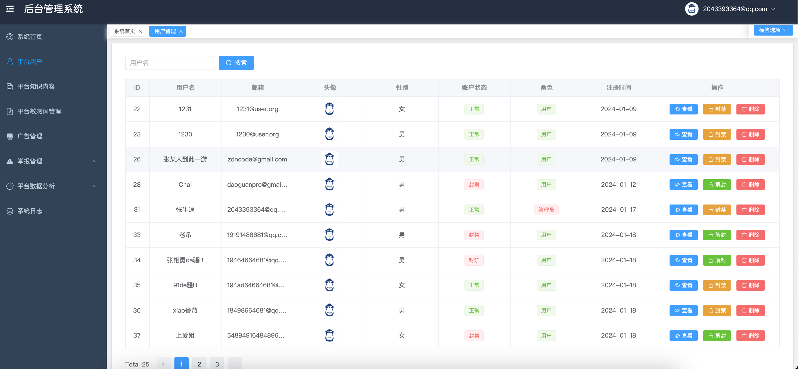
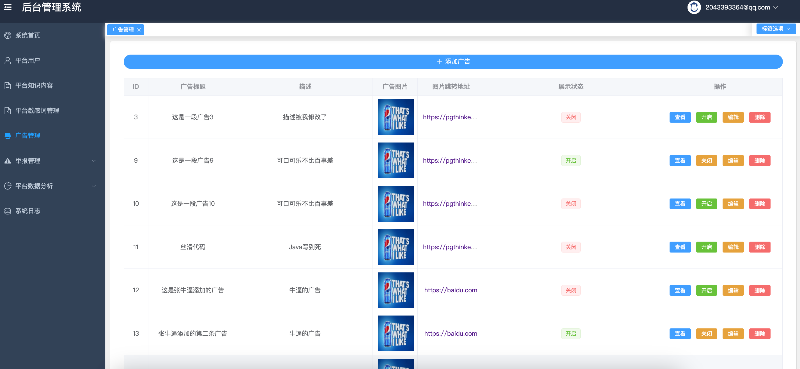
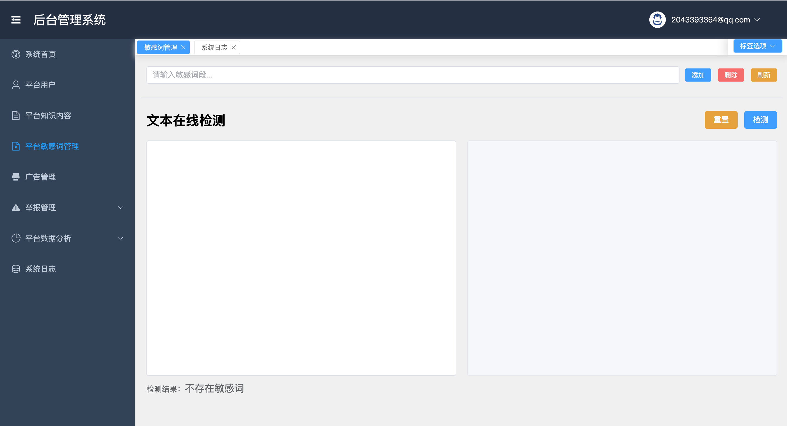
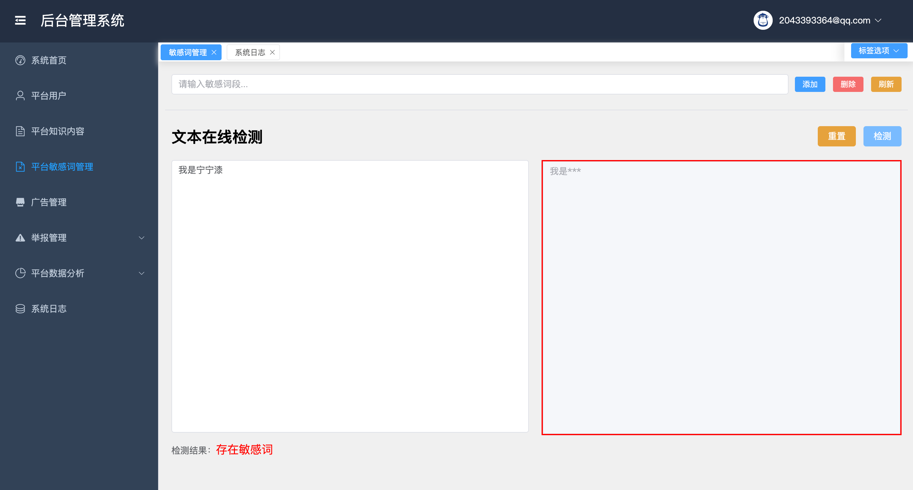
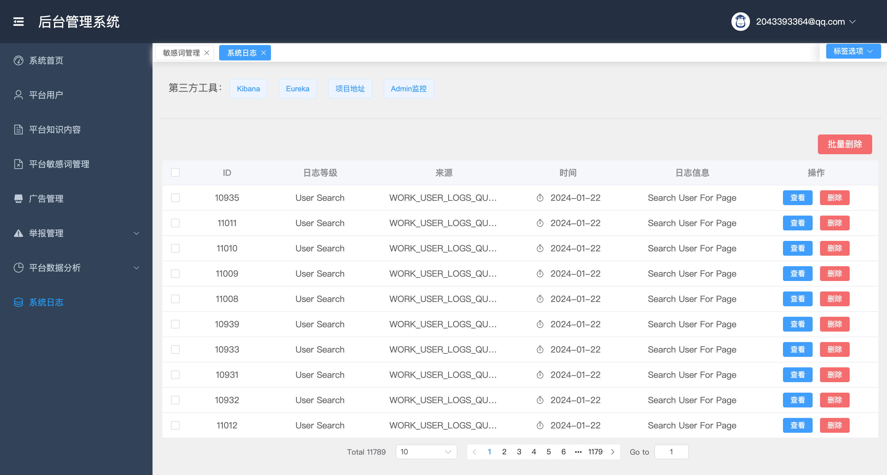

#### 知识内容详情页

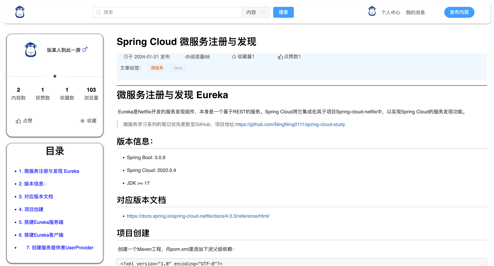

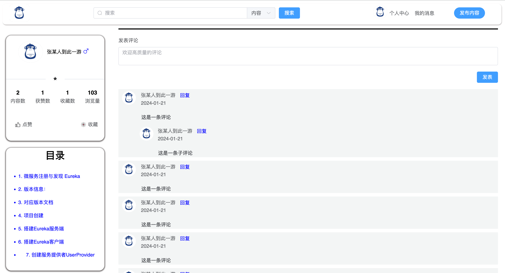

## 编写日志

### 后端业务

- [x] [2024-01-08]() 完成用户基本的身份授权模块（实现 JWT 技术）
- [x] [2024-01-09]() 完成基于邮箱认证的登录注册模块（验证码发送、注册、登录）
- [x] [2024-01-10]() 完成广告业务模块、日志业务模块;优化接口响应，统一响应数据
- [x] [2024-01-11]() 优化敏感词检测模块、完成 ES 搜索模块（根据文章内容关键字、标题关键字、分类关键字、文章概述关键字进行检索）、优化微服务的日志记录（基于 RabbitMQ 实现对用户操作的记录、对系统内部异常记录）
- [x] [2024-01-12]() 整合了知识内容的发布、修改、删除、查询，知识内容的点赞、收藏和评论，配置所有微服务的网关，配置 admin 微服务日志监控组件；基于 RabbitMQ 实现 MySQL 数据库与 ES 数据的同步更新。

### 前端业务

- [x] [2024-01-14]() 登录、注册页面
- [x] [2024-01-15]() 首页
- [x] [2024-01-16]() 构建后台页面框架，完成用户首页、文章发布页设计
- [x] [2024-01-18]() 完成用户后台界面，管理员后台（用户管理、广告管理，首页）;成功对接登录、注册、验证码发送、用户管理接口、广告管理接口。
- [x] [2024-01-19]() 对接 ES 搜索模块，实现基于标题、内容、概述、标签的知识内容搜索.
- [x] [2024-01-21]() 完成知识详情页、点赞、收藏、评论
- [x] [2024-01-22]() 完成平台敏感词管理、日志管理模块;添加用户个人媒体库;
- [x] [2024-01-23]() 完成管理员首页模块、用户媒体库模块（文件上传和下载）

### 总结

&emsp;作为我的第一个微服务项目，我的工作重心竟然因为小组里没有负责前端的同学导致我大部分的时间都花在了前端业务上，而后端业务用了一周就草草了结，这造成后面前后端对接时出现了接口缺失的情况。同时因为之前没有相关的微服务项目开发经验，模块的划分被我过于细化，导致整个后端业务维护起来很麻烦。

&emsp;关于每个子服务的配置文件，可以使用 Spring Cloud Config 进行统一配置和管理，因为时间原因，当时没法进行配置，后续代码复盘时或许会进行优化。
